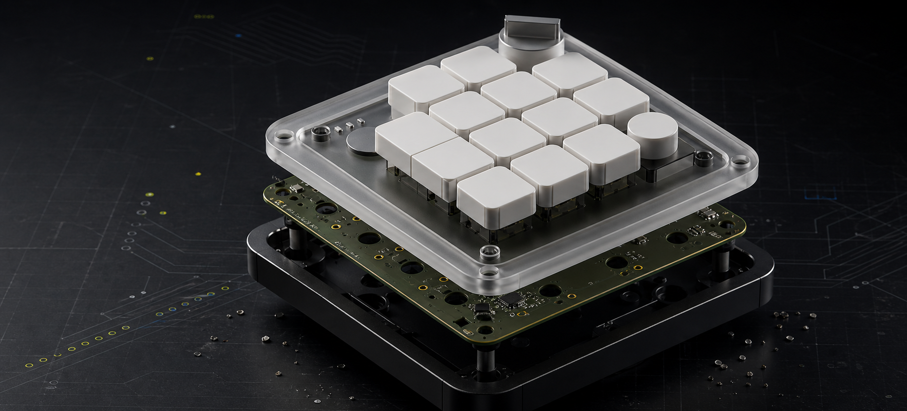
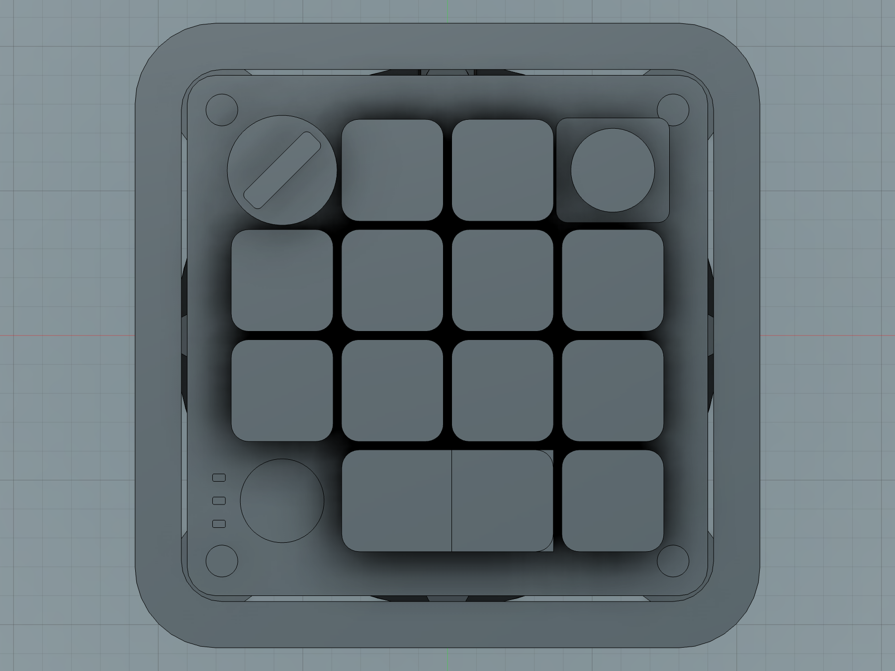
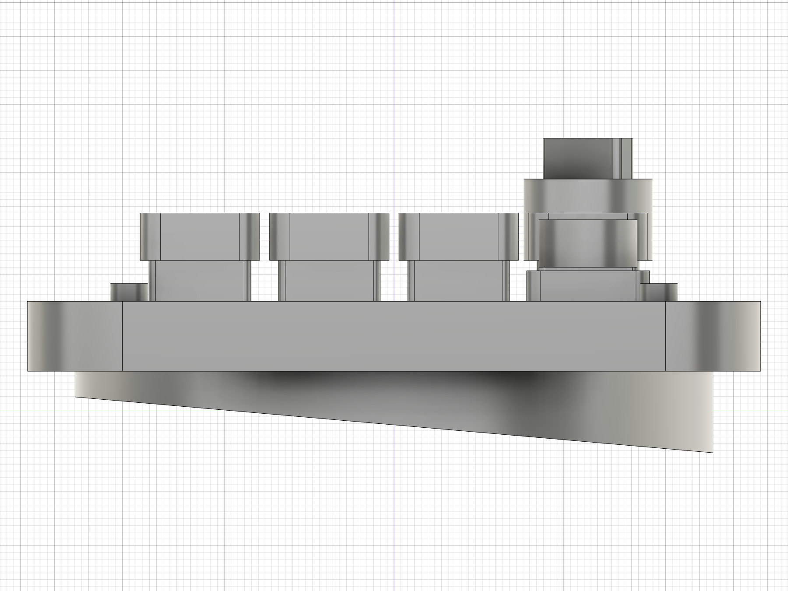
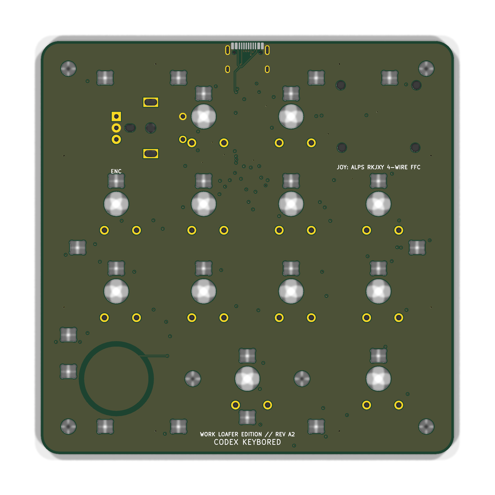
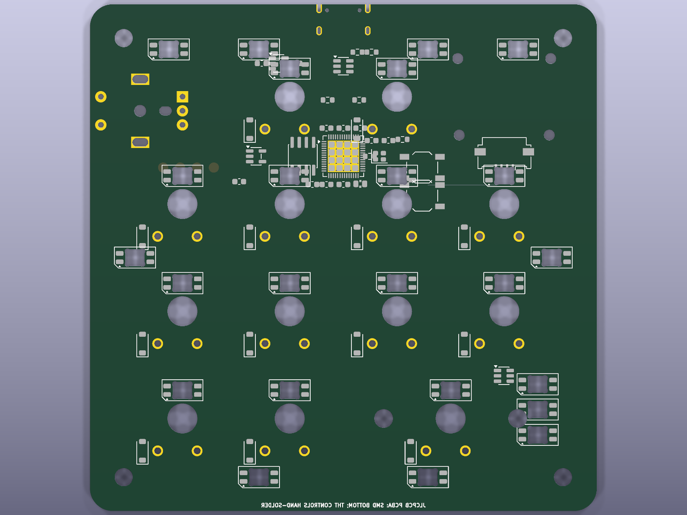
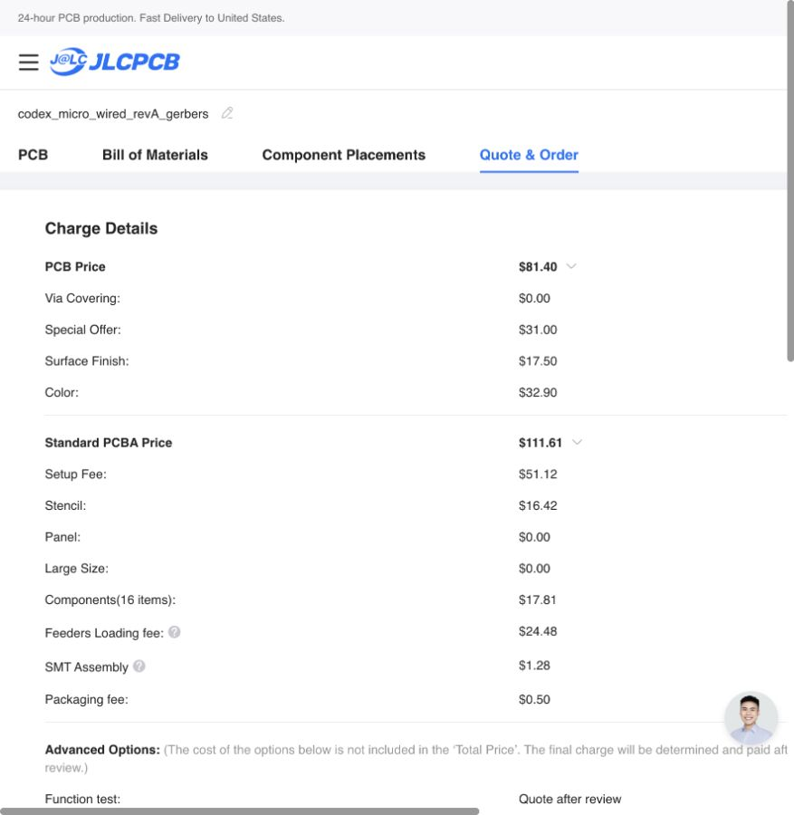
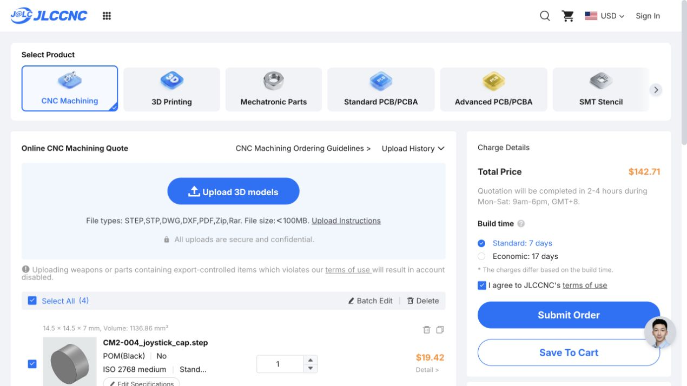
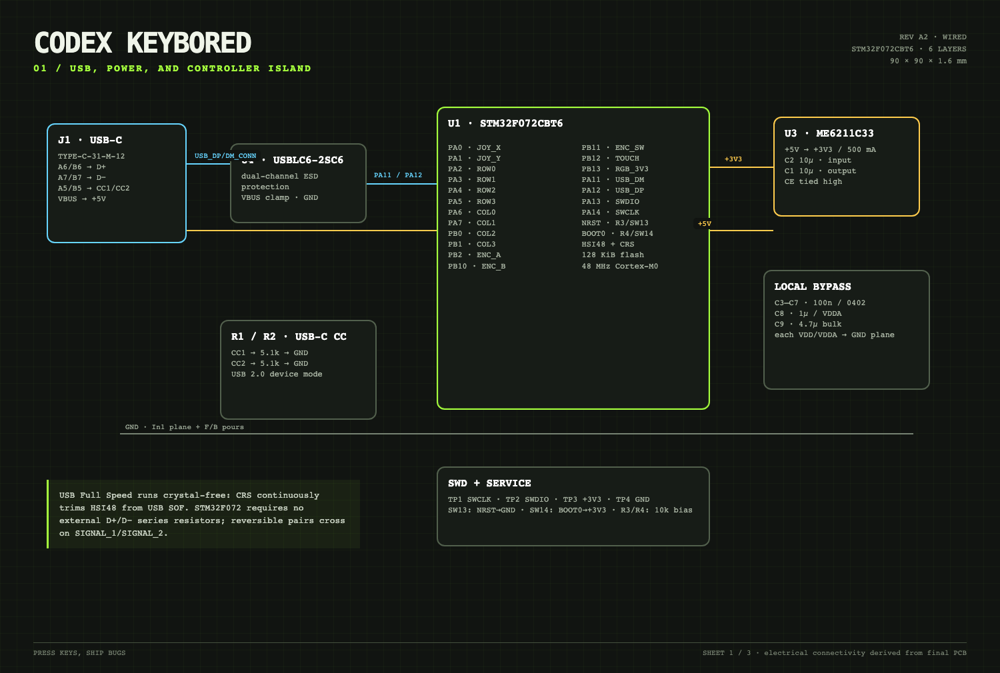
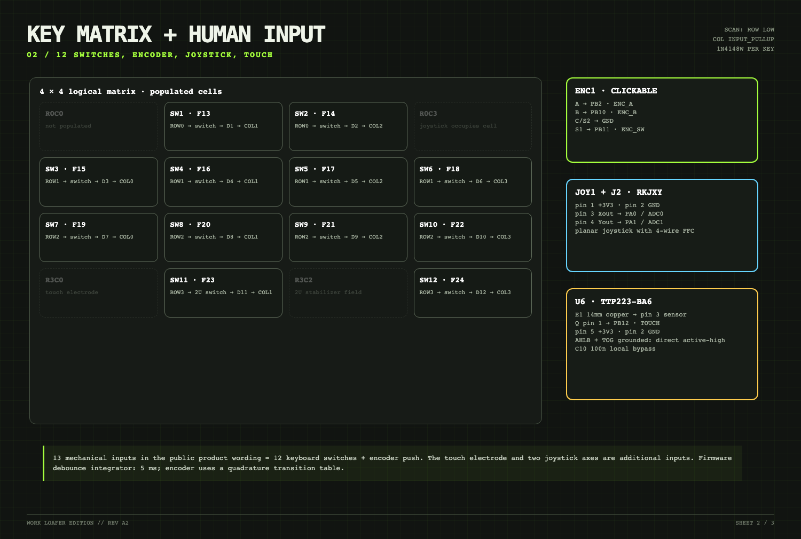

<p align="center">
  
</p>

<h1 align="center">CODEX KEYBORED</h1>
<h3 align="center">WORK LOAFER EDITION · REV A2</h3>

<p align="center">
  A from-scratch, manufacturable parody of the Codex Micro: Fusion 360 mechanics,<br>
  four quoted CNC parts, a wired six-layer PCB, turnkey assembly instructions, and working USB HID firmware.
</p>

<p align="center">
  <a href="https://happy.engineering/codex-keybored/"><b>VIEW THE MANUFACTURING DOSSIER</b></a>
  &nbsp;·&nbsp;
  <a href="output/CODEX_KEYBORED_RevA2_turnkey_factory_handoff.zip"><b>DOWNLOAD FACTORY HANDOFF</b></a>
  &nbsp;·&nbsp;
  <a href="fusion/Codex_Micro_RevA.f3d"><b>OPEN FUSION ARCHIVE</b></a>
</p>

<p align="center">
  
  
  
  
</p>

---

<h1 align="center">THIS IS NOT A DISCLAIMER.<br>THIS IS THE WHOLE POINT.</h1>

<h1 align="center">ABSOLUTELY EVERYTHING HERE IS 100% VIBE-CODED.</h1>

<h1 align="center">
  FROM THE FIRST PROMPT TO FUSION 360, KICAD, GERBERS, FIRMWARE,<br>
  AND A REAL UPLOAD INTO JLCPCB + JLCCNC.
</h1>

<h2 align="center">
  THIS IS THE PRODUCT STORY: ONE CONTINUOUS VIBE<br>
  FROM A PUBLIC PRODUCT IMAGE<br>
  TO A REAL, QUOTED, FACTORY-READY HARDWARE STACK.
</h2>

<p align="center">
  <b>THE DELIGHTFUL PART IS THAT THE VIBE DID NOT STOP WHEN THE WORK BECAME PHYSICAL.</b><br>
  It crossed industrial design, parametric CAD, CNC drawings, multilayer electronics, component sourcing,
  USB firmware, factory testing, pricing, and vendor handoff. Every layer is editable, inspectable, and ready to continue.
</p>

## One vibe, all the way to the factory

Most vibe-coded projects end at a screenshot. This one kept going until the pixels became toleranced solids, the solids became quoted CNC parts, the control layout became a routed six-layer PCB, the PCB became Gerbers/BOM/CPL, the firmware became checksummed factory binaries, and the whole stack became live JLC manufacturing jobs.

That is the fun of this repository: the same conversational build loop moves through every engineering discipline without hiding the seams. An observation such as “the aluminum base is slightly tilted” does not remain a note—it becomes a revised **5° Fusion body**, a new STEP export, a new drawing, a successful JLCCNC import, a corrected **$54.56** quote, and a cleaned cart. A request such as “I do not want to solder switches” becomes a both-side PCBA configuration, consigned-parts manifest, 74-position placement file, manual assembly contract, flashing procedure, and functional acceptance test.

| Vibe-coding pass | What was created | Where it became real |
|---|---|---|
| **Look closely** | Public renders were compared, scaled, and converted into an explicit confirmed/measured/inferred datum set | Research notes + manufacturing dossier |
| **Make it solid** | A parametric 108 × 108 mm assembly, corrected wedge, pockets, fasteners, light pipe, joystick cap | Fusion 360 archive + four STEP/DXF packages |
| **Make it electronic** | A clean-room STM32F072 architecture, matrix, USB-C, touch, joystick, 24 RGB pixels, six copper layers | KiCad source + 0-error DRC + IPC netlist |
| **Make it behave** | USB HID firmware, neutral F13–F24 map, RGB safety limit, factory browser test | BIN/HEX/ELF + SHA-256 checksums |
| **Make it buildable** | LCSC mappings, BOM/CPL, specialty-parts sourcing, manual operations, inspection gates | Turnkey factory ZIP + controlled SOP |
| **Make the factory answer** | CAD and fabrication files were uploaded into authenticated quote flows | Four JLCCNC items + JLCPCB job Y5 |

```text
PROMPT → RESEARCH → DIMENSIONS → FUSION 360 → STEP/DXF → JLCCNC
                     ↓
              ELECTRICAL PLAN → KICAD → GERBER/BOM/CPL → JLCPCB
                     ↓
              FIRMWARE → FACTORY TEST → TURNKEY HANDOFF → A FEW FINAL SCREWS
```

The result is not “AI made a picture of a keyboard.” The result is a versioned hardware project in which a vibe-driven decision can be traced from sentence to parameter, from parameter to geometry or net, and from production file to a factory price. **That end-to-end continuity is the project.**

---

## The whole device, not just a render

| Mechanical | Electronics | Factory route |
|---|---|---|
| **108 × 108 mm** outer envelope | **90 × 90 mm**, six copper layers | **4 CNC parts** already quoted |
| **5°** machined aluminum wedge | STM32F072 + USB-C + TinyUSB | **5 PCBs / 2 PCBA** in turnkey job Y5 |
| Parametric Fusion assembly + STEP/DXF | 12 keys + encoder + touch + joystick | Specialty parts consigned to the factory |
| Polycarbonate, PMMA, POM, 6061-T6 | 24 reverse-mount RGB pixels | Flash, functional test, and evidence in SOP |
| Controlled drawing pack | **0 DRC violations / 0 unconnected nets** | Customer closes only a few enclosure screws |

<table>
  <tr>
    <td width="50%"><br><sub><b>FUSION 360 / TOP</b> — measured mechanical interface</sub></td>
    <td width="50%"><br><sub><b>FUSION 360 / SIDE</b> — corrected 5° wedge</sub></td>
  </tr>
  <tr>
    <td width="50%"><br><sub><b>PCB / TOP</b> — WORK LOAFER EDITION silk</sub></td>
    <td width="50%"><br><sub><b>PCB / BOTTOM</b> — controller island, power, matrix, RGB</sub></td>
  </tr>
</table>

## Yes: the factory does the hand work

> **ZERO SOLDERING AT HOME.** The production route asks JLC to place both-side SMD, manually install the twelve switches and encoder, fit the joystick/FFC, flash the STM32, exercise all 20 USB HID events, inspect all 24 RGB emitters, and install the caps on the primary unit. The customer-facing operation is enclosure closure after first-article approval.

The automatic JLC matcher uses the catalog-only [BOM](electronics/production/codex_micro_wired_revA_jlc_bom.csv) and [CPL](electronics/production/codex_micro_wired_revA_jlc_cpl.csv). The complete manual/secondary-operation contract is in the [turnkey SOP](electronics/production/CODEX_KEYBORED_RevA2_TURNKEY_SOP.md), [expanded BOM](electronics/production/codex_micro_wired_revA_turnkey_bom.csv), [74-position CPL](electronics/production/codex_micro_wired_revA_turnkey_cpl.csv), and [consigned-parts manifest](electronics/production/codex_micro_wired_revA_consigned_parts.csv).

```text
SOURCE SPECIALTY PARTS  →  BOTH-SIDE PCBA  →  MANUAL CONTROLS
         →  FLASH + FUNCTION TEST  →  PHOTO EVIDENCE  →  ENCLOSURE CLOSURE
```

## Live manufacturing snapshot

Quotes were captured in an authenticated JLC session on **July 17, 2026**. Prices are dynamic and exclude possible tax, duty, and engineering-review additions.

| Job | Configuration | Captured price |
|---|---|---:|
| CM2-001 upper housing | CNC polycarbonate, qty 1 | **$58.96** |
| CM2-002 angled weight | CNC 6061-T6, 5° wedge, qty 1 | **$54.56** |
| CM2-003 light pipe | CNC frosted PMMA, qty 1 | **$40.62** |
| CM2-004 joystick cap | CNC POM fit prototype, qty 1 | **$19.42** |
| **JLCCNC subtotal** | Four corrected production items | **$173.56** |
| **JLCPCB turnkey base** | Five PCBs + two both-side Standard PCBA | **$193.01** |
| **Captured manufacturing floor** | Before manual review, special parts, tax/duty/shipping adjustments | **$366.57** |

<p align="center">
  
  
</p>

The **$193.01** PCB/PCBA figure is a captured base, not a promise of a finished-device total. Programming, functional test, secondary manual operations, and consigned-part handling remain quote-after-review. The saved cart proves that the geometry and six-layer board can enter the vendor workflow; JLC engineering approval is still the gate before payment.

## What is actually in the repository

| Area | Source of truth | Ready-to-send artifact |
|---|---|---|
| Fusion mechanics | [`fusion/build_codex_micro_mechanical.py`](fusion/build_codex_micro_mechanical.py) | [`Codex_Micro_RevA.f3d`](fusion/Codex_Micro_RevA.f3d) |
| CNC geometry | Fusion BRep bodies | [`cnc/STEP/`](cnc/STEP/) + [`cnc/DXF/`](cnc/DXF/) |
| CNC dimensions | Parametric model + controlled notes | [`CM2_CNC_Drawing_Pack_RevA.pdf`](cnc/drawings/CM2_CNC_Drawing_Pack_RevA.pdf) |
| PCB connectivity/layout | [`codex_micro_wired_revA.kicad_pcb`](electronics/kicad/codex_micro_wired_revA.kicad_pcb) | [Gerber/drill ZIP](electronics/production/codex_micro_wired_revA_gerbers.zip) |
| Assembly data | Board-derived generator | [JLC BOM](electronics/production/codex_micro_wired_revA_jlc_bom.csv) + [JLC CPL](electronics/production/codex_micro_wired_revA_jlc_cpl.csv) |
| Principle schematic | Final routed connectivity | [Three-sheet PDF](output/pdf/CODEX_KEYBORED_RevA2_schematic.pdf) + [IPC-D-356](electronics/production/netlist/CODEX_KEYBORED_RevA2.ipc) |
| Firmware | [`firmware/stm32/`](firmware/stm32/) | [BIN](firmware/stm32/release/codeks_keybored_revA.bin) + [HEX](firmware/stm32/release/codeks_keybored_revA.hex) + [checksums](firmware/stm32/release/SHA256SUMS.txt) |
| Factory contract | Rev A2 manufacturing assumptions | [Turnkey factory handoff ZIP](output/CODEX_KEYBORED_RevA2_turnkey_factory_handoff.zip) |
| Full report | Evidence, screenshots, prices, sources | [Single-page dossier](https://happy.engineering/codex-keybored/) + [PDF](output/pdf/CODEX-KEYBORED-Manufacturing-Dossier-RevA2.pdf) |

## Electrical architecture

- STM32F072CBT6, 128 KB flash, crystal-less HSI48 + CRS USB.
- USB-C device input, dual 5.1 kΩ CC resistors, USBLC6 ESD protection.
- Six layers: `F.Cu`, GND plane, two signal layers, `+5V` plane, `B.Cu`.
- Twelve low-profile matrix switches plus clickable encoder.
- Capacitive touch and two-channel analog planar joystick.
- 24 × SK6812MINI-E: twelve per-key, nine underglow, three status.
- Build-verified TinyUSB firmware with BIN/HEX/ELF artifacts and a browser factory test.
- Housing interface intentionally remains compatible with a future replacement ESP32-S3/BLE board.

<p align="center">
  
  
</p>

## Mechanical datum set

The coordinate origin is the device center. `+Y` points toward the rear edge; `+Z` points upward.

| Parameter | Value | Confidence | Basis |
|---|---:|---|---|
| Key pitch | 19.05 mm | **CONFIRMED** | Work Louder MX keycap specification |
| Installed keyboard switches | 12 | **CONFIRMED** | Visible layout + Creator Micro 2 specification |
| Total mechanical switch inputs | 13 | **CONFIRMED** | Includes encoder push |
| Outer envelope | 108 × 108 mm | **MEASURED** | Official top render scaled from key centers |
| Top PCB/panel | 90 × 90 × 1.6 mm | **MEASURED / INFERRED** | Render scale + standard PCB thickness |
| PCB screw pitch | 78 × 78 mm | **MEASURED** | Provisional ±0.5 mm |
| Upper housing | 108 × 108 × 10.3 mm, R14 | **MEASURED** | Public front/side/top renders |
| Aluminum bottom | Ø94 mm, 3.8→12.0 mm, 5° | **MEASURED / INFERRED** | Side profile + CNC construction |
| Joystick candidate | Alps RKJXY1000006 | **CANDIDATE** | Available electrical/mechanical sibling |

Confidence language is deliberate:

- **CONFIRMED** — explicitly published by OpenAI, Work Louder, or a component manufacturer.
- **MEASURED** — scaled from a public, near-orthographic product render.
- **INFERRED** — a manufacturable placeholder that still requires physical first-article inspection.

## CNC material directions

The quoted build uses clear/diffusing polycarbonate, black-anodized 6061-T6, frosted PMMA, and POM. A wood variant is also practical: machine the upper housing from stabilized maple, walnut, or laminated birch, retain the aluminum wedge, and keep the separate frosted PMMA light pipe so the underglow is not blocked. Leave at least 2.5–3.0 mm wall thickness around the pocket and tune 0.15–0.25 mm radial clearance after the first machining coupon.

All four STEP files passed JLC's automated CNC import. The bottom was explicitly corrected from an early flat disc to the observed **5° wedge** before the current quote was saved.

## Reproduce it

1. Open or create the Fusion document named `Codex`, then run [`fusion/build_codex_micro_mechanical.py`](fusion/build_codex_micro_mechanical.py).
2. Export/audit CNC bodies with the scripts in [`fusion/`](fusion/) and compare them with the controlled drawing pack.
3. Open the board in KiCad 10 and verify the committed DRC report before regenerating fabrication data.
4. Build the STM32 target from [`firmware/stm32/`](firmware/stm32/) or use the checksummed release image.
5. Upload the Gerber ZIP, JLC BOM/CPL, CNC STEP files, drawing pack, and turnkey factory ZIP.
6. Do not authorize production until JLC DFM, polarity/rotation, manual-operation scope, and first-article dimensions are reviewed.

## Prototype status and provenance

This is an **independent private prototype**, reconstructed from official public product renders and published platform/component documentation. It is not an official OpenAI or Work Louder CAD/electronics release, is not affiliated with or endorsed by either company, and contains no leaked manufacturing data.

The digital production gate is clean: Gerbers, drill files, BOM/CPL, IPC netlist, three-sheet principle schematic, firmware, STEP/DXF, drawings, and vendor quote evidence are present. The physical gate is still open: no fabricated Rev A2 board has completed electrical bring-up, EMC evaluation, or dimensional fit-check. Use a current-limited supply, verify the 3.3 V rail and SWD first, and treat the first order as an engineering prototype.

Primary research links and detailed source notes live in the [manufacturing dossier](https://happy.engineering/codex-keybored/) and [`firmware-and-compliance-notes.md`](firmware-and-compliance-notes.md).

---

<h2 align="center">PRESS KEYS. SHIP BUGS.</h2>
<p align="center"><b>CODEX KEYBORED / WORK LOAFER EDITION / REV A2</b></p>
